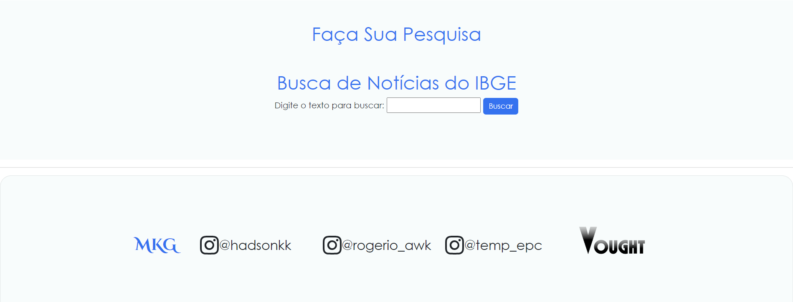
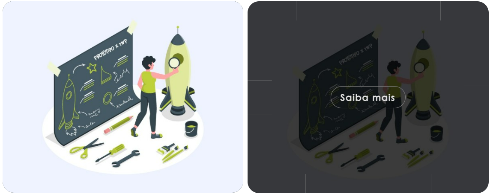
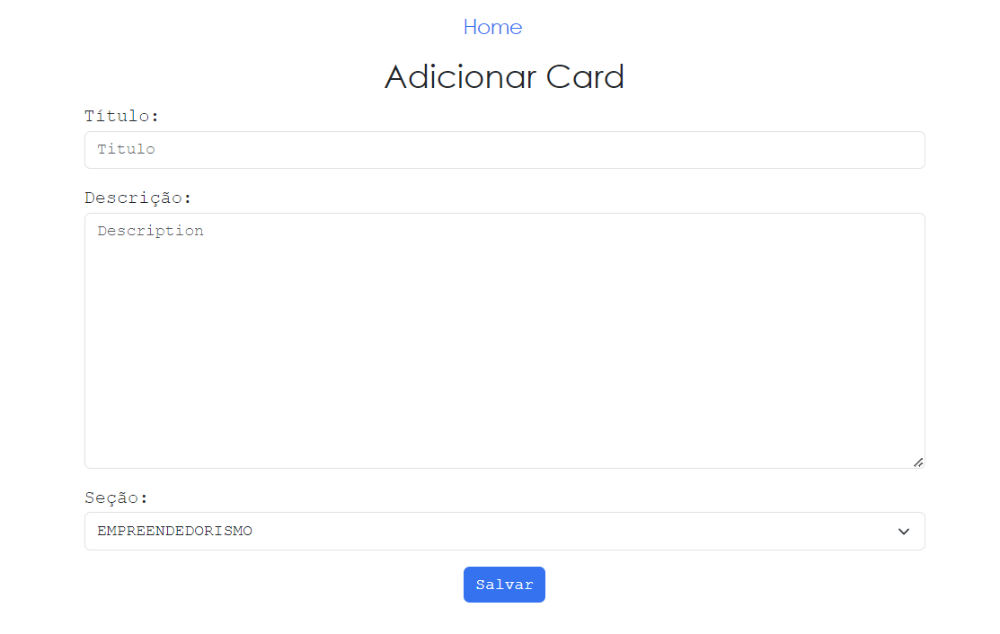
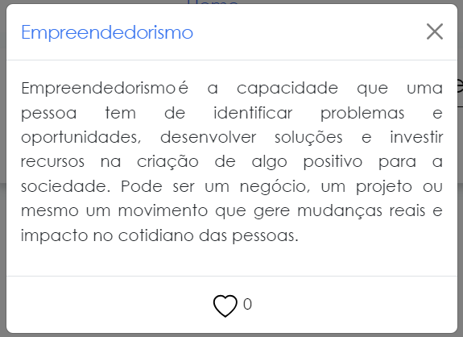
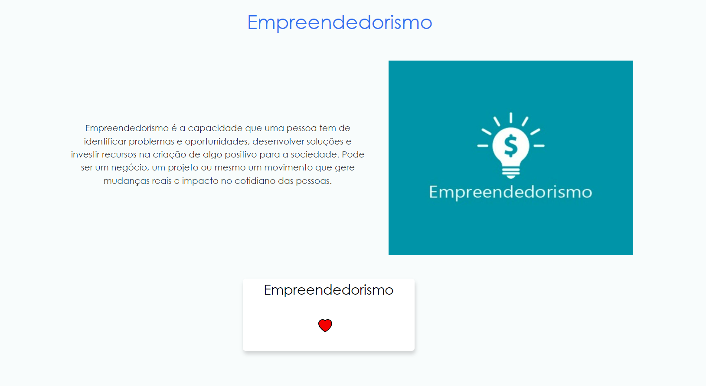
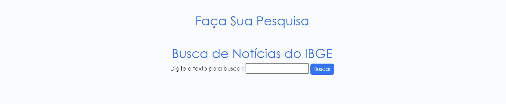

# Passo a Passo para utilizar o site MKG

Este guia irá mostrar todas as funcionalidades do site para garantir que os usuários possam aproveitar ao máximo.

## Passo 1: Elementos da página inicial

Na página inicial são apresentados 
   - `Header`: A parte superior da página contendo o logotipo e a área de login/register
   - `Carrossel`: Uma apresentação de slides com imagens e informações destacadas.
   - `Card`: Blocos de informações resumidas sobre diferentes tópicos.
   - `Área de Noticias do IBGE`: Sessão dedicada às notícias fornecidas pelo IBGE.
   - `Footer`: A parte inferior da página com informações de contato e links úteis.

## Passo 2: Registro e login de usuário  

Nesta seção, os usuários podem se registrar ou fazer login para acessar funcionalidades adicionais do site.

## Passo 3: Card Flip

Demonstração do efeito de flip nos cards, onde o usuário pode visualizar mais informações ao passar o mouse.

No site existem 5 card flips que possuem um botão de "saiba mais" que ao ser clicado é levado a uma seção específica do tema do card (Passo 6)

## Passo 4: Area de criação de Cards

Espaço dedicado para os usuários criarem novos cards, personalizando o conteúdo conforme suas necessidades.

## Passo 5: Modal Card 

Ao clicar em algum card do carrossel ou de uma seção será exibido uma modal do respectivo card.

## Passo 6: Seção de conteúdo

Seção destinada a exibir diferentes tipos de conteúdo, tais como:
   
   - `Empreendedorismo`
   - `Start Up`
   - `Protótipo`
   - `Pitch`
   - `Mentoria`

## Passo 7: Area de pesquisa utilizando API

Área onde os usuários podem realizar pesquisas utilizando uma API, retornando resultados relevantes.

## Passo 8: Resultado da pesquisa

Visualização dos resultados de uma pesquisa realizada na área de pesquisa.

