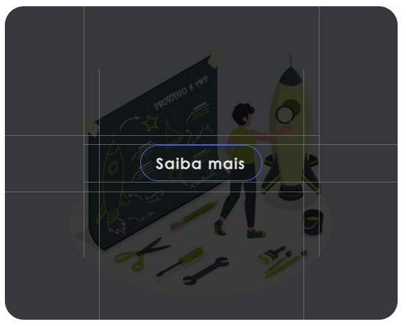

# Passo a Passo para utilizar o site MKG

Este guia irá mostrar todas as funcionalidades do site para garantir que os usuários possam aproveitar ao máximo.

## Passo 1: Elementos da página inicial

Na página inicial são apresentados 
   - `Header`: 
   - `Carrossel`:
   - `Card`:
   - `Área de Noticias do IBGE`:
   - `Footer`:

## Passo 2: Card Flip

  
  

